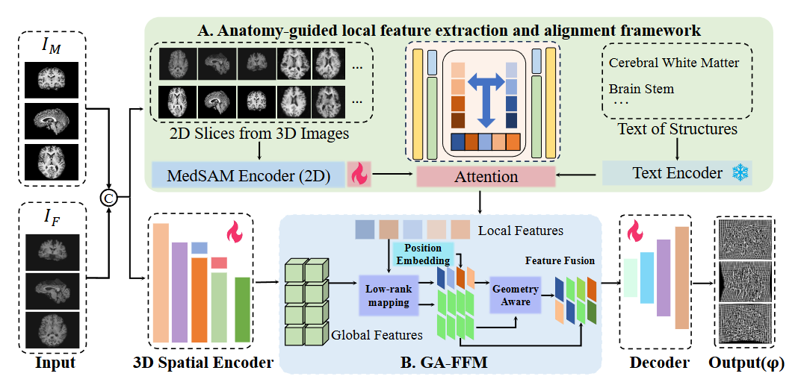

# MICCAI2025_SAMReg
The code of our paper for MICCAI2025

## Abstract

Medical image registration is essential for aligning heterogeneous imaging data to ensure accurate anatomical correspondence, yet current methods struggle to simultaneously capture fine-grained local details and maintain global spatial coherence. To address this limitation, we propose MGGA, a MedSAM-Guided Geometry-Aware framework that fuses 2D and 3D features for medical image registration. These 2D local representations are then semantically aligned using a CLIP-based text encoder. In parallel, a lightweight 3D encoder captures global spatial dependencies across the volume. To bridge the gap between dimensions and scales, we introduce a Geometry-Aware 2D-3D Feature Fusion Module (GA-FFM), which adaptively aligns and fuses 2D and 3D features based on Gaussian Similarity and Cosine Similarity. Furthermore, a dual-layer regularization strategy combining explicit mask-level constraints and implicit semantic guidance reinforces anatomical plausibility and deformation smoothness. Extensive experiments on brain MRI (patient-to-patient and atlas-to-patient) and abdominal CT datasets demonstrate that MGGA consistently outperforms state-of-the-art methods in DSC, ASSD, and HD95, while preserving topological validity. These results highlight the effectiveness and generalizability of our framework in achieving accurate, robust, and anatomically consistent registration across diverse imaging modalities and tasks. The code is available at: https://github.com/goghfan/MGGA.

